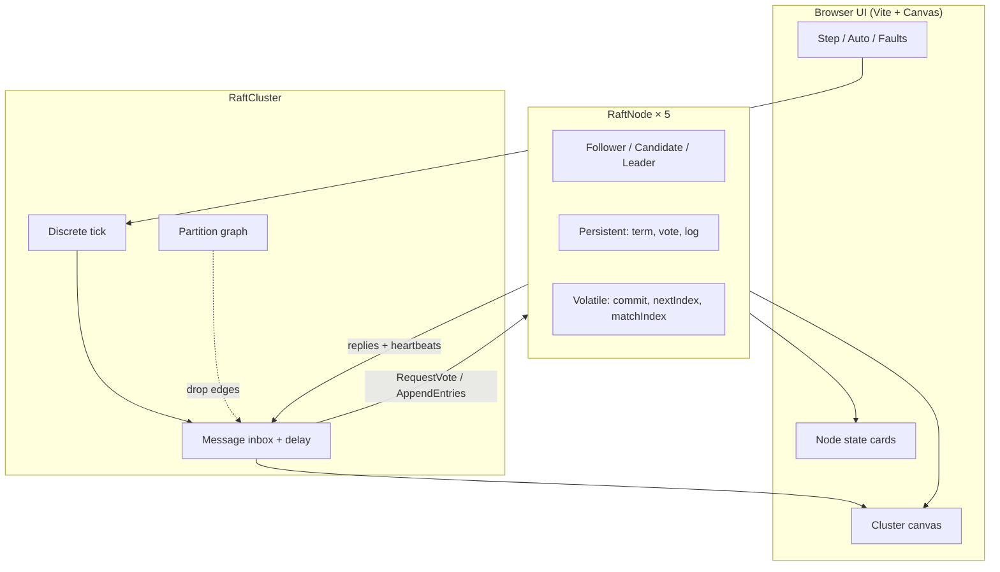

# raft-lab

**Interactive Raft consensus simulator** — election, log replication, and majority commit under crashes and partitions, with a testable TypeScript state machine and a live canvas.

[](https://github.com/SK090347/raft-lab/actions/workflows/ci.yml)
[](LICENSE)

> Author: **Sumit Kumar Ta (SK090347)** · Dual license **MIT OR Apache-2.0**

---

## Mathematics / Formulation

Raft elects a leader and replicates a totally ordered log. With cluster size $n$, a **majority quorum** is

$$
q = \left\lfloor \frac{n}{2} \right\rfloor + 1
$$

### Election

A candidate wins term $T$ when it collects $q$ votes (including self). Vote grant requires:

1. Candidate term $\ge$ voter’s current term
2. Voter has not voted for another candidate in $T$
3. Candidate log is **at least as up-to-date** (last log term, then last index)

Election safety: at most one leader per term (votes are exclusive within a term).

### Log replication & commit

Leader appends client commands as $(\mathrm{term}, \mathrm{index}, \mathrm{command})$. An entry at index $i$ is **committed** when a majority of peers report `matchIndex[i]` covering it **and** the entry’s term equals the leader’s current term (Figure 2 commit rule).

$$
\mathrm{commitIndex} = \max\bigl\{ i : |\{p : \mathrm{matchIndex}[p] \ge i\}| \ge q\ \wedge\ \mathrm{log}[i].\mathrm{term} = T_{\mathrm{leader}} \bigr\}
$$

### What is computed / invariant

| Quantity | Meaning |
|----------|---------|
| `currentTerm` | Logical clock; increases on timeouts / higher-term RPCs |
| `commitIndex` | Highest log index known durable on a majority |
| Leader uniqueness | $\le 1$ leader per term |
| Log matching | Same index+term $\Rightarrow$ identical prefix |

**Why this formula?** Majority quorums guarantee that any two quorums intersect — the combinatorial heart of Raft safety. Implementing election + replication under partitions makes that intersection tangible.

---

## Why this exists

Raft ([Ongaro & Ousterhout, USENIX ATC 2014](https://raft.github.io/raft.pdf)) is the consensus algorithm most engineers actually implement. Reading the paper is necessary; **seeing** election timeouts, majority votes, log matching, and commit advancement under partitions is what makes it stick.

`raft-lab` packages:

1. A **faithful core state machine** (`src/raft/`) you can unit-test like a distributed-systems lab.
2. A **visual simulator** so recruiters and students can poke the algorithm live.
3. **CI + TypeScript + Vitest** — production hygiene, not a toy demo.

---

## Quick start

```bash
npm install
npm test          # Raft unit tests
npm run dev       # Vite → http://localhost:5173
npm run build     # typecheck + production bundle
```

### Simulator controls

| Control | Effect |
|--------|--------|
| **Step** | Advance one discrete tick (deliver due RPCs, then election/heartbeat timers) |
| **Auto** | Continuous ticking; Speed slider ≈ ticks/sec |
| **Submit** | Client command → current leader’s log (no-op if no leader) |
| **Crash / Restart** | Kill or revive a peer (volatile state wiped; term/vote/log persist) |
| **Isolate / Heal** | Partition a node from all others, or clear every cut |

---

## Architecture



### Core library layout

```
src/raft/
  types.ts      # Role, LogEntry, RPC payloads, Envelope
  node.ts       # Single-peer Raft state machine (Figure 2)
  cluster.ts    # Multi-node clock, network, partitions, client submit
  index.ts      # Public exports
src/ui/         # Canvas renderer + control panel
tests/          # Vitest: election + replication
```

---

## Correct Raft behaviors implemented

| Behavior | Notes |
|----------|--------|
| Election timeout → Candidate | Randomized timeout per node |
| `RequestVote` | Term checks, at-most-one vote per term, log up-to-date rule |
| Majority → Leader | Then immediate `AppendEntries` heartbeat |
| Heartbeats | Reset follower election deadlines; step down Candidates |
| Log replication | `prevLogIndex` / `prevLogTerm` match; truncate conflicts; append |
| Commit index | Leader commits only current-term entries with majority `matchIndex` |
| Crash / restart | Volatile state cleared; persistent fields retained |
| Partitions | Minority cannot elect; majority continues; heal → catch-up |

This is a **teaching simulator**, not a production Raft (no disk persistence, no snapshotting, no membership change). The goal is clarity of the Figure 2 state machine under fault injection.

---

## What recruiters learn about you

- You can turn a research paper into a **testable TypeScript state machine**.
- You reason about **distributed failure modes** (partitions, crashes, split votes).
- You ship a **polished interactive demo** with CI, dual licensing, and math documented in-repo.
- You know the difference between “I watched a Raft video” and “I implemented election + replication.”

---

## Tests

```bash
npm test
```

Vitest covers leader election, log replication, and commit advancement under basic fault scenarios.

---

## License

Dual-licensed under **MIT** OR **Apache-2.0** — see [LICENSE](LICENSE), [LICENSE-APACHE](LICENSE-APACHE), and [NOTICE](NOTICE).

## Author

**Sumit Kumar Ta** ([SK090347](https://github.com/SK090347))

## Topics

`raft` · `consensus` · `distributed-systems` · `typescript` · `simulation` · `portfolio`
