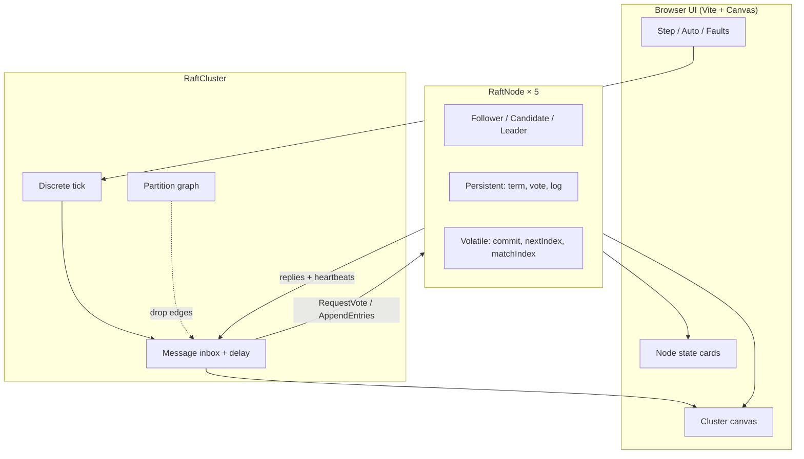

# raft-lab

**Interactive Raft consensus simulator** — a browser teaching lab at MIT 6.824 caliber.

Five peers elect a leader, replicate a log, and advance a commit index while you inject crashes, partitions, and client commands. Step the discrete-time clock or let it auto-tick. Watch RequestVote / AppendEntries messages fly across a canvas.

> Author: **Sumit Kumar Ta (SK090347)** · Dual license **MIT OR Apache-2.0**

---

## Why this exists

Raft ([Ongaro & Ousterhout, USENIX ATC 2014](https://raft.github.io/raft.pdf)) is the consensus algorithm most engineers actually implement. Reading the paper is necessary; **seeing** election timeouts, majority votes, log matching, and commit advancement under partitions is what makes it stick.

`raft-lab` is a portfolio-flagship project that packages:

1. A **faithful core state machine** (`src/raft/`) you can unit-test like a 6.824 lab.
2. A **visual simulator** so recruiters and students can poke the algorithm live.
3. **CI + TypeScript + Vitest** — production hygiene, not a toy demo.

---

## Quick start

```bash
npm install
npm test          # Raft unit tests
npm run dev       # Vite → http://localhost:5173
npm run build     # typecheck + production bundle
```

### Simulator controls

| Control | Effect |
|--------|--------|
| **Step** | Advance one discrete tick (deliver due RPCs, then election/heartbeat timers) |
| **Auto** | Continuous ticking; Speed slider ≈ ticks/sec |
| **Submit** | Client command → current leader’s log (no-op if no leader) |
| **Crash / Restart** | Kill or revive a peer (volatile state wiped; term/vote/log persist) |
| **Isolate / Heal** | Partition a node from all others, or clear every cut |

---

## Architecture



### Core library layout

```
src/raft/
  types.ts      # Role, LogEntry, RPC payloads, Envelope
  node.ts       # Single-peer Raft state machine (Figure 2)
  cluster.ts    # Multi-node clock, network, partitions, client submit
  index.ts      # Public exports
src/ui/         # Canvas renderer + control panel
tests/          # Vitest: election + replication
```

---

## Correct Raft behaviors implemented

| Behavior | Notes |
|----------|--------|
| Election timeout → Candidate | Randomized timeout per node |
| `RequestVote` | Term checks, at-most-one vote per term, log up-to-date rule |
| Majority → Leader | Then immediate `AppendEntries` heartbeat |
| Heartbeats | Reset follower election deadlines; step down Candidates |
| Log replication | `prevLogIndex` / `prevLogTerm` match; truncate conflicts; append |
| Commit index | Leader commits only current-term entries with majority `matchIndex` |
| Crash / restart | Volatile state cleared; persistent fields retained |
| Partitions | Minority cannot elect; majority continues; heal → catch-up |

This is a **teaching simulator**, not a production Raft (no disk persistence, no snapshotting, no membership change). The goal is clarity of the Figure 2 state machine under fault injection.

---

## What recruiters learn about you

- You can turn a research paper into a **testable TypeScript state machine**.
- You reason about **distributed failure modes** (partitions, crashes, split votes).
- You ship a **polished interactive demo** with CI, dual licensing, and docs — not a half-finished notebook.
- You know the difference between “I watched a Raft video” and “I implemented election + replication.”

---

## Tests

```bash
npm test
```

Coverage includes:

- Stable-network leader election (exactly one leader)
- Re-election after leader crash
- Minority partition cannot elect; majority can
- Client command replicates and commits on majority
- Multi-entry ordered commit
- Follower catch-up after isolation

---

## References

1. Diego Ongaro & John Ousterhout, [*In Search of an Understandable Consensus Algorithm*](https://raft.github.io/raft.pdf) (USENIX ATC 2014) — the Raft paper.
2. [The Secret Lives of Data — Raft visualization](https://thesecretlivesofdata.com/raft/) — excellent narrative animation.
3. MIT 6.824: Distributed Systems — Lab 2 (Raft) inspiration for teaching depth.
4. [raft.github.io](https://raft.github.io/) — canonical Raft site & implementations list.

---

## License

Dual-licensed under **MIT** and **Apache-2.0**. See [`LICENSE`](./LICENSE), [`LICENSE-APACHE`](./LICENSE-APACHE), and [`NOTICE`](./NOTICE). Use either at your option.

```
Copyright 2026 Sumit Kumar Ta (SK090347)
```
